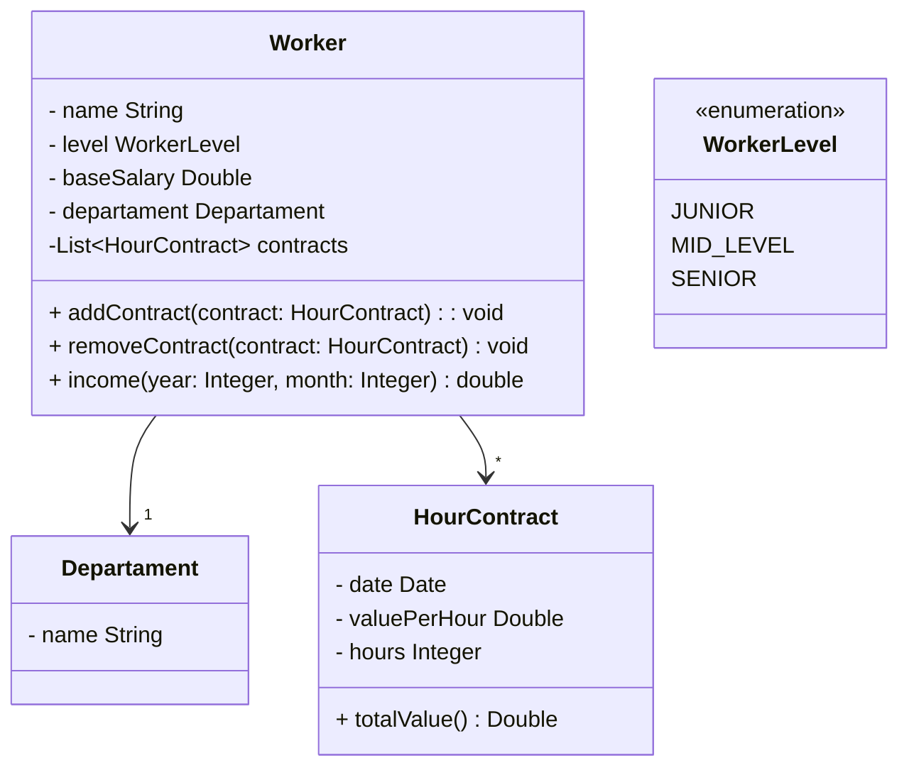

# Sobre

Programa criado através do curso "[Java COMPLETO Programação Orientada a Objetos + Projetos](https://www.udemy.com/course/java-curso-completo/)" de [Nelio Alves](https://github.com/acenelio/composition1-java)

# Funcionamento

